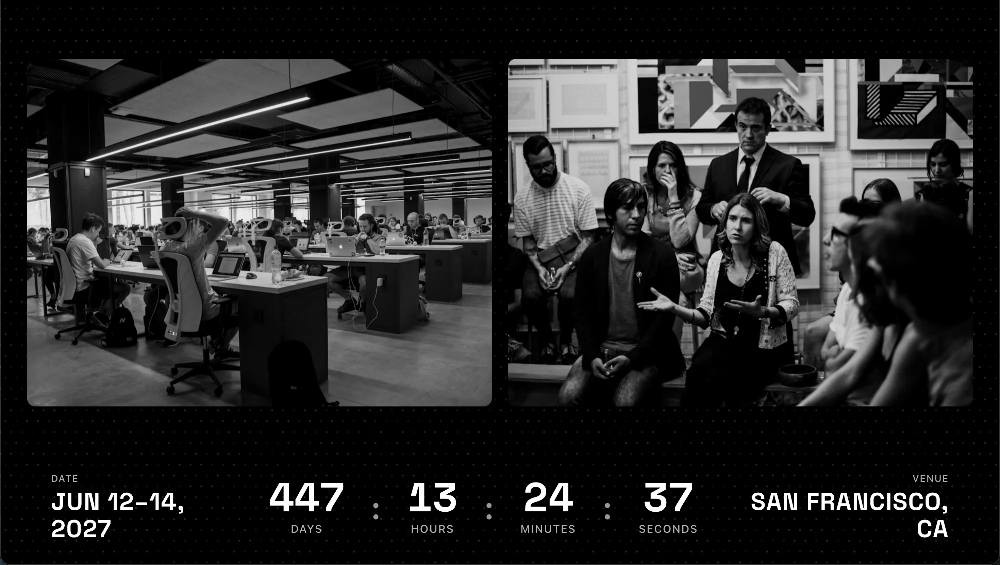
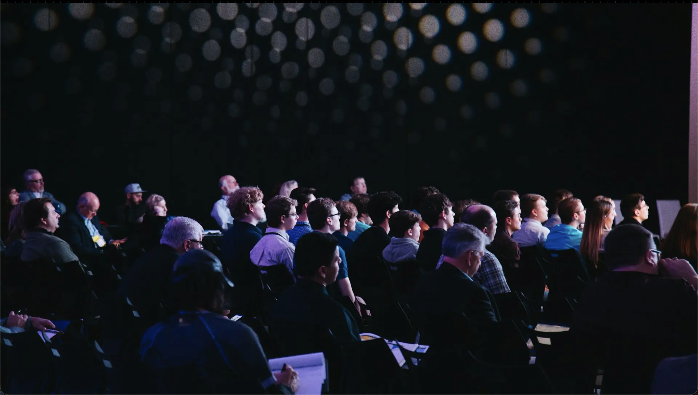

# Nexus Summit

A polished **conference / summit** site built with **Next.js 16**, **React 19**, **Tailwind CSS 4**, and **Framer Motion**. It’s designed as a template you can fork: swap the name, dates, venue, and imagery, and you’re ready to promote your event.

---

## What you get

- **Hero** with parallax image, gradient into brand blue, and clear CTAs  
- **About** with countdown, venue, and scroll-based image motion  
- **Speakers**, **Why attend**, **sessions strip**, **featured schedule**  
- **Tickets** (three tiers), **partners** marquees, **FAQ**, **CTA**, **image marquee**  
- **Nav** with dropdowns + mobile menu; **footer** with links and contact  

The demo below uses **Nexus Summit 2027** and placeholder copy—treat it as a starting point, not final branding.

---

## Walkthrough

Full scroll-through of the site (with audio if your file includes it):

<video src="docs/readme-assets/nexus-summit-walkthrough.mov" width="100%" controls playsinline></video>

[Open or download the video](./docs/readme-assets/nexus-summit-walkthrough.mov)

---

## Screenshots

| Hero & nav | Parallax + countdown |
|:------------:|:---------------------:|
|  |  |

| Speakers | Tickets |
|:--------:|:-------:|
|  |  |

---

## Run it locally

```bash
npm install
npm run dev
```

Open [http://localhost:3000](http://localhost:3000).

```bash
npm run build   # production build
npm run start   # run production server
```

---

## Customize for your event

| What to change | Where to look |
|----------------|---------------|
| Site title & SEO | `src/app/layout.tsx` |
| Hero headline, dates, city | `src/components/nexus/HeroNextConfo.tsx` |
| About copy & countdown target | `src/components/nexus/AboutSection.tsx` |
| Speakers / sessions / tickets / FAQ | Matching files under `src/components/nexus/` |
| Partner logos | `public/partners/` + `MeetOurPartners.tsx` |
| Remote images | Allowed hosts in `next.config.ts` (`images.unsplash.com`, …) |

Search the repo for `Nexus`, `nexusconf.example.com`, and `2027` to catch straggler copy.

---

## Tech stack

- [Next.js](https://nextjs.org/) (App Router)  
- [Tailwind CSS](https://tailwindcss.com/) v4  
- [Framer Motion](https://www.framer.com/motion/)  

Deploy anywhere Node runs; **[Vercel](https://vercel.com)** is the path of least resistance for Next.js.

---

## License

Use this template freely for your own conferences and meetups. A credit in the footer is appreciated but not required.

---

*Built as a template—make it yours.*
